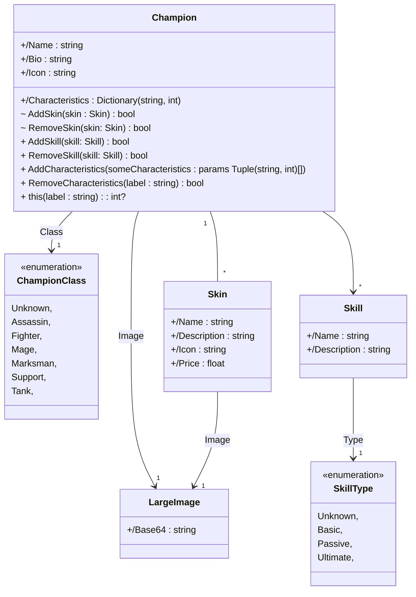
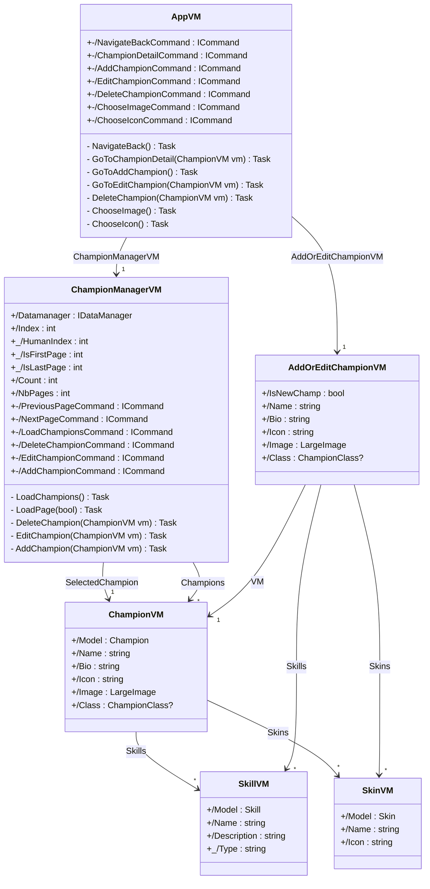

# LoL_Champions

## 📝 Purpose

Create a [**MAUI**](https://learn.microsoft.com/en-us/dotnet/maui/) application using **MVVM** to implement a given model.

- Available on Android & IOS
- Work on ViewModel (views are not important)

## 🛠 Languages & tools

## 🖊️ Versions 

- [.NET 7](https://learn.microsoft.com/en-us/dotnet/core/whats-new/dotnet-7)
- [Android API](https://developer.android.com/reference) 33 *(tested)*
- [iOS](https://www.apple.com/ios) 16 *(tested)*

## 📍 Visuals

> Please note that the screenshots from the original app were taken with an Iphone.
> Thoses of the "Clone-app" were taken with an Android with a different resolution.

 Main Pages 

| OriginalApp | CloneApp |
| --- | --- |
|  |  |
|  |  |
|  |  |
|  |  |
|  |  |
|  |  |

 Other Pages 

| OriginalApp | CloneApp |
| --- | --- |
|  |  |
|  |  |
|  |  |
|  |  |
|  |  |

## ⚙️ Architecture

> Theses diagrams are not fully accurate and only gave the global idea of the conception.

 Models 

---

 ViewModels 

## ✍️ Credits 

* Author: [**Valetin Clergue**](https://github.com/HandyS11)