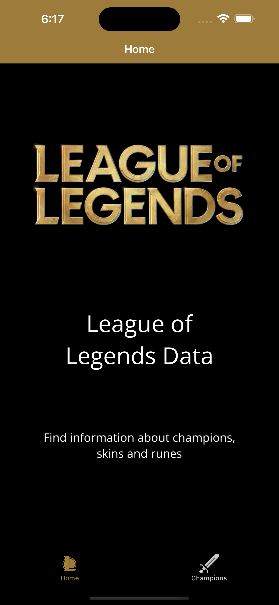

# LoL_Champions

## 📝 Purpose

Create a [**MAUI**](https://learn.microsoft.com/en-us/dotnet/maui/) application using **MVVM** to implement a given model.

- Available on Android & IOS
- Work on ViewModel (views are not important)

## 📊 Features

**Done:**
1. Champion list *+ navigation*
2. Champion detail
3. Caracteristics management
4. Champion management
5. Swipe view *(\<MenuItem\> because of Android problems)*
6. Skills management
7. Skins management

**NotDone:**
- You can't remove a Skin
- You can't edit a Caracteristic

**V2**: [MVVM_Toolkit](https://github.com/HandyS11/LoL_Champions/tree/mvvm_toolkit)

## 🛠 Languages & tools


## 🖊️ Versions 

- [.NET 7](https://learn.microsoft.com/en-us/dotnet/core/whats-new/dotnet-7)
- [Android API](https://developer.android.com/reference) 33 *(tested)*
- [iOS](https://www.apple.com/ios) 16 *(tested)*

## 📍 Visuals

> Please note that the screenshots from the original app were taken with a different phone of the CloneApp ones.

<details><summary> Main Pages </summary>

| OriginalApp | CloneApp |
| --- | --- |
|  |  |
|  |  |
|  |  |
|  |  |
|  |  |
|  |  |
|  |  |
</details>

<details><summary> Other Pages </summary>

| OriginalApp | CloneApp |
| --- | --- |
|  |  |
|  |  |
|  |  |
|  |  |
|  |  |
</details>

## ⚙️ Architecture

> Theses diagrams are not fully accurate and only gave the global idea of the conception.

<details><summary> Models </summary>


</details>

---

> Every **VM** inherits from `BaseViewModel` which implements `INotifyPropertyChanged` and `SetProperty` to notify the view of any changes and setting properties.

<details><summary> ViewModels </summary>


</details>

## ⚡️ Known limitations

Due to its youngness *(and ~~maybe~~ certainly because of my lack of knowledge)* the **CollectionView**, **SwapView** and others seems to have been implemented differently through the platforms leading to some issues.

> For exemple this code works on Android but got problems of height on iOS
```xml
<CollectionView ItemsSource="{Binding SomeCollection}"
                SelectionMode="None">
    <CollectionView.ItemsLayout>
        <GridItemsLayout Orientation="Vertical" 
                         Span="2" />
    </CollectionView.ItemsLayout>
                    
    <CollectionView.ItemTemplate>
        <DataTemplate>
            <SomeComponent/>
        </DataTemplate>
    </CollectionView.ItemTemplate>
</CollectionView>
```

## ✍️ Credits 

* Author: [**Valetin Clergue**](https://github.com/HandyS11)
